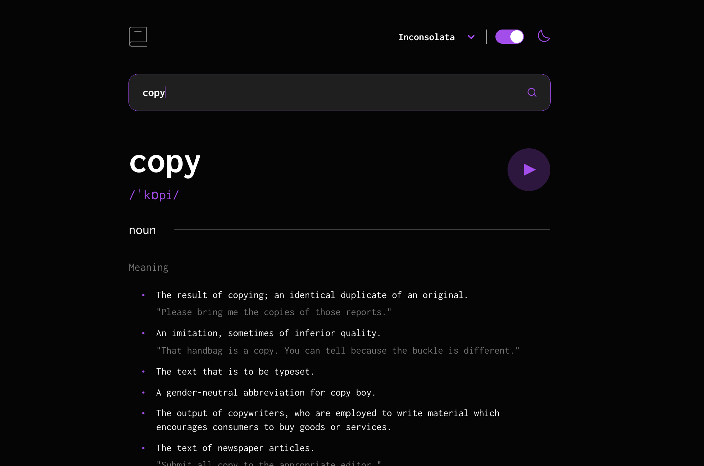

# Frontend Mentor - Dictionary web app solution

This is a solution to the [Dictionary web app challenge on Frontend Mentor](https://www.frontendmentor.io/challenges/dictionary-web-app-h5wwnyuKFL). Frontend Mentor challenges help you improve your coding skills by building realistic projects. 

## Table of contents

- [Overview](#overview)
  - [The challenge](#the-challenge)
  - [Screenshot](#screenshot)
  - [Links](#links)
- [My process](#my-process)
  - [Built with](#built-with)
  - [What I learned](#what-i-learned)
  - [Continued development](#continued-development)
- [Author](#author)

## Overview

### The challenge

Users should be able to:

- Search for words using the input field
- See the Free Dictionary API's response for the searched word
- See a form validation message when trying to submit a blank form
- Play the audio file for a word when it's available
- Switch between lora, inter, and inconsolata fonts
- Switch between light and dark themes
- View the optimal layout for the interface depending on their device's screen size
- See hover and focus states for all interactive elements on the page
- **Bonus**: Have the correct color scheme chosen for them based on their computer preferences. _Hint_: Research `prefers-color-scheme` in CSS.

### Screenshot

### Links

- Solution URL: [https://github.com/Kulya1986/fm_project3_dictionary_app](https://github.com/Kulya1986/fm_project3_dictionary_app)
- Live Site URL: [Add live site URL here](https://your-live-site-url.com)

## My process

### Built with

- Semantic HTML5 markup
- CSS custom properties
- Flexbox
- CSS Grid
- [React](https://reactjs.org/) - JS library
- [Select Component](https://react-select.com/) - React JS library for custom Select component

### What I learned

This project helped me to improve my knowledge of conditional rendering of React components. Also I've practised in styling custom controls (color theme switcher) and usage of custom React components (font selector).

### Continued development

In next projects plan to focus on using React Hooks

## Author

- Website - [Nataliia Kulyk](https://starlit-lollipop-cd1397.netlify.app)
- Frontend Mentor - [@Kulya1986](https://www.frontendmentor.io/profile/Kulya1986)
